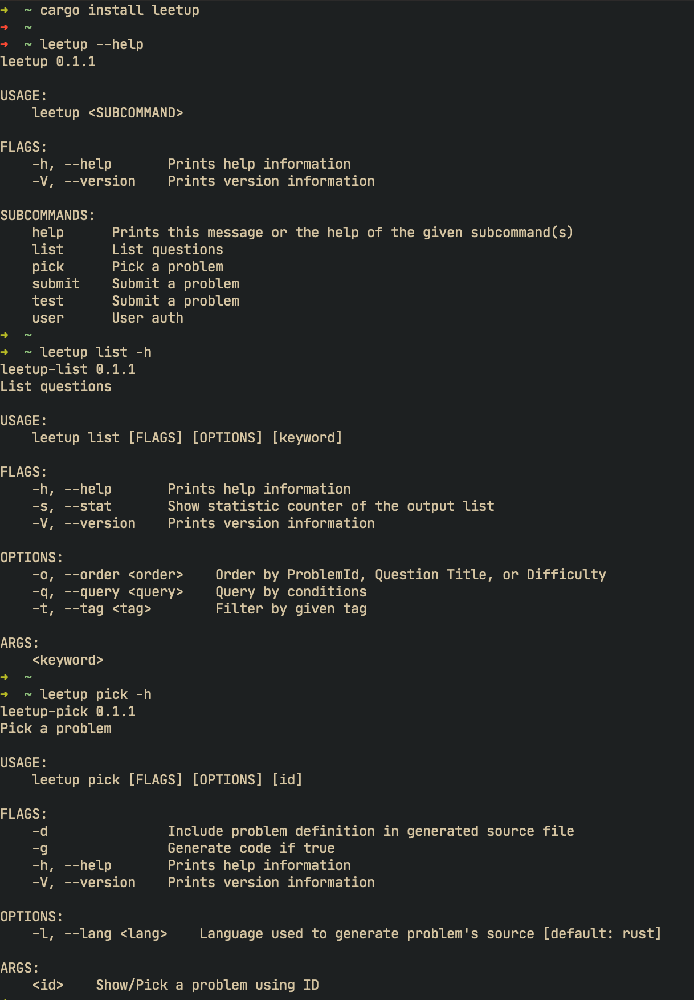
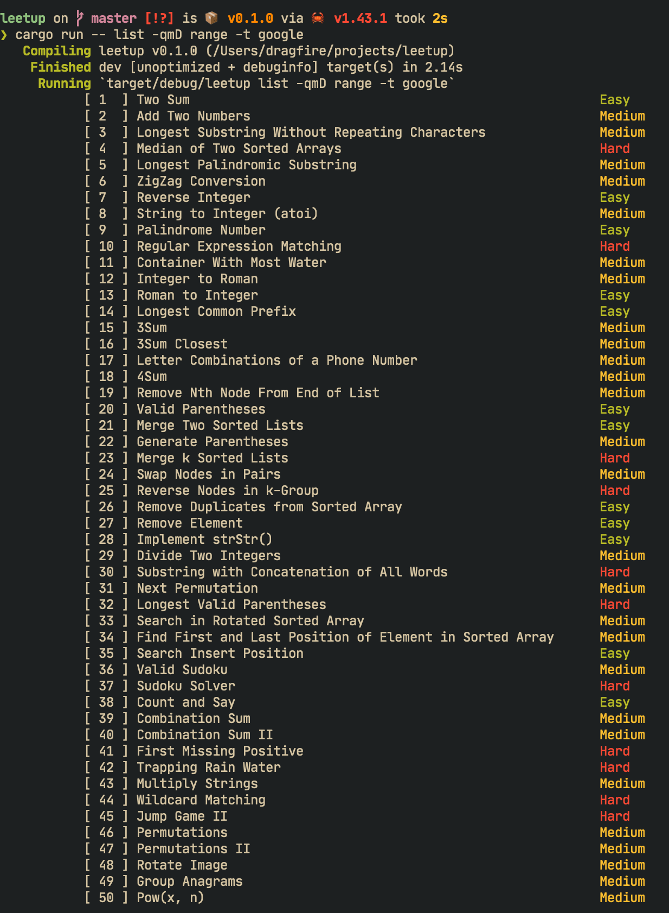

   [](https://travis-ci.org/dragfire/leetup)  
# leetup
Leetcode cli

## Install
- MacOS:
```sh
curl -LSfs https://japaric.github.io/trust/install.sh | sh -s -- --git dragfire/leetup
```

- Linux:
```sh
curl -LSfs https://japaric.github.io/trust/install.sh | sh -s -- --git dragfire/leetup
```

- Cargo:
```sh
cargo install leetup
```
- Windows:  
Download from . Extract the zipped x86_64 windows target file.
> Note: You will need to add `leetup.exe` to PATH to access from Command Prompt.


## Usage:





### Credit:
This project is inspired by: https://github.com/leetcode-tools/leetcode-cli
